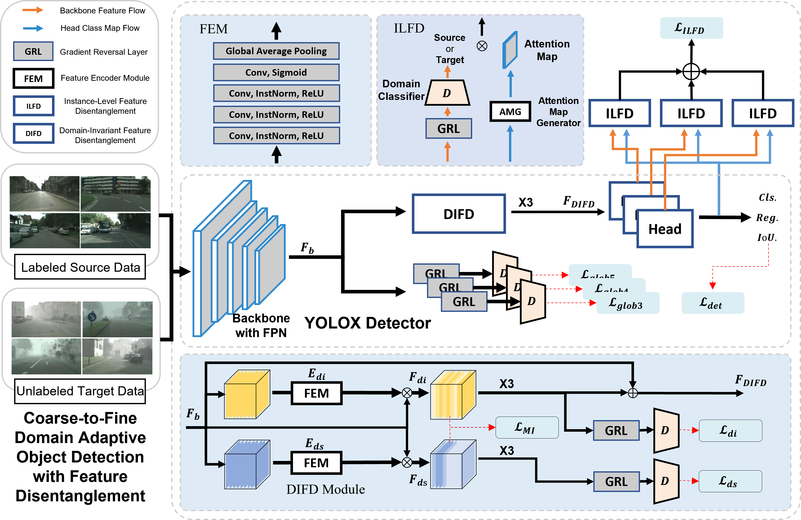
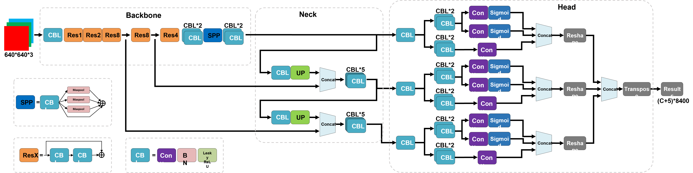

# DRY：Coarse-to-Fine Domain Adaptation Object Detection with Feature Disentanglement

### Abstract
Domain adaptation object detection (DAOD) uses the labeled data of one scene (i.e., the source domain) and the unlabeled data of another unfamiliar scene (i.e., the target domain) to train the cross-domain object detector. Most existing methods align the overall distribution of features by adversarial adaptive methods. Despite their success, these methods are primarily designed for two-stage detectors that are challenging to deploy, resulting in limited practical applications. In addition, owing to the instability of adversarial domain discriminator training, inducing the detector is difficult using only an adversarial adaptive strategy to extract instance-level domain-invariant features to align the overall distribution. To address these issues, we propose a new cross-domain object detection framework based on the You Only Look Once (YOLO) series of algorithms named Disentanglement Representation YOLO (DRY). The developed method achieves feature disentanglement in the channel dimension and spatial dimensions through domain-invariant feature disentanglement (DIFD) and instance-level feature disentanglement (ILFD) modules, respectively, prompting the detector to extract domain-invariant features. Experiments demonstrate that our model outperforms existing methods. It achieved an average accuracy value of 42.7 on the Cityscapes to FoggyCityscapes benchmark and significantly outperformed all other methods on human and car objects. The average accuracy values of 49.0 and 49.5 achieved on the SIM10K to Cityscapes and KITTI to Cityscapes scenarios, respectively, are superior to those of existing methods. Extensive experimental results on various datasets verify that the proposed DRY method is effective and widely applicable.

### Contributions
1) The disentanglement representation YOLO (DRY) framework is proposed to implement domain adaptation object detection for a single-stage YOLO series detector.Compared with works based on two-stage detectors, cross-domain detection based on an efficient YOLO series detector has higher inference speed and efficiency.
2) The DIFD module is proposed for inducing backbone extraction of domain-invariant features by disentangling domain-specific and domain-invariant parts from backbone features.
3) The ILFD module is proposed for guiding the adversarial domain discriminator to concentrate on instance-level domain-invariant features by disentangling the foreground and background parts.
4) Extensive experiments performed in common cross-domain scenarios qualitatively and quantitatively demonstrate the effectiveness of DRY.

### Model
Due to the inability to upload large files in Guthub, we have uploaded our optimal model to Google Cloud Drive at the [link](https://drive.google.com/file/d/1iqEhEscleOlL_tr6G2JpmjknY9Ik4zt5/view?usp=sharing)

The link to the optimal model for other fog densities is [link](https://drive.google.com/drive/folders/1DPevWOIVhNHuvoJy5j_UpqJSMFFE0Ca6?usp=sharing)

### YOLOX structure
The DRY continues to use the head structure of YOLOX for the detection head.

### Code
The code for this program will be published soon.
